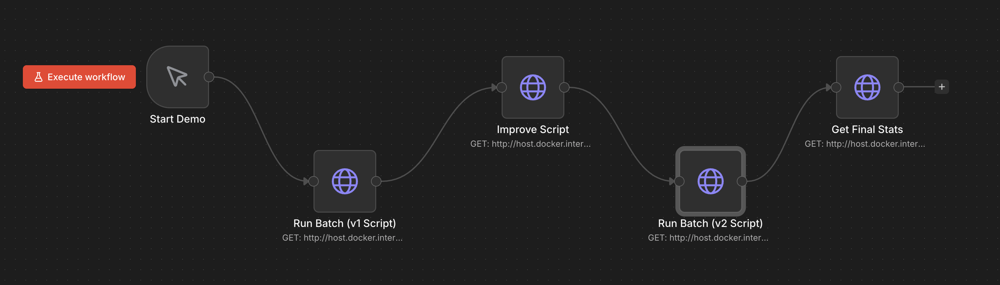
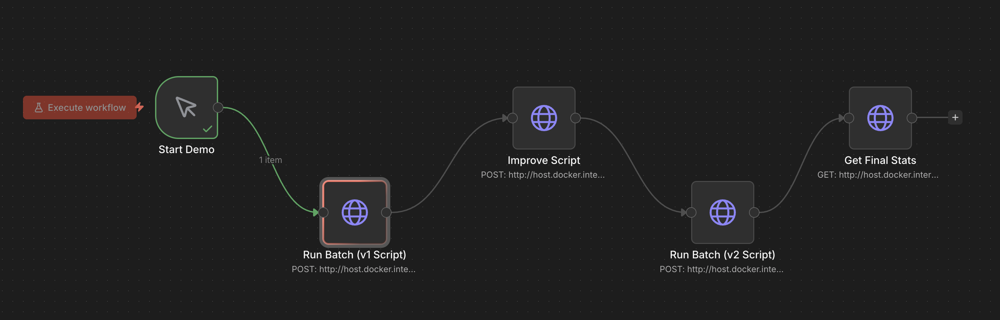
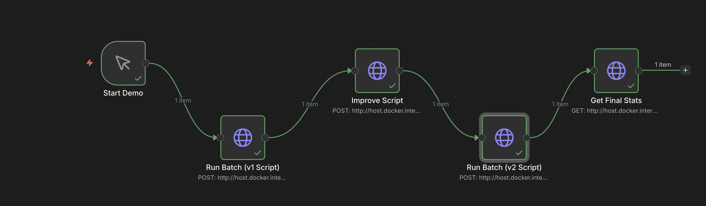
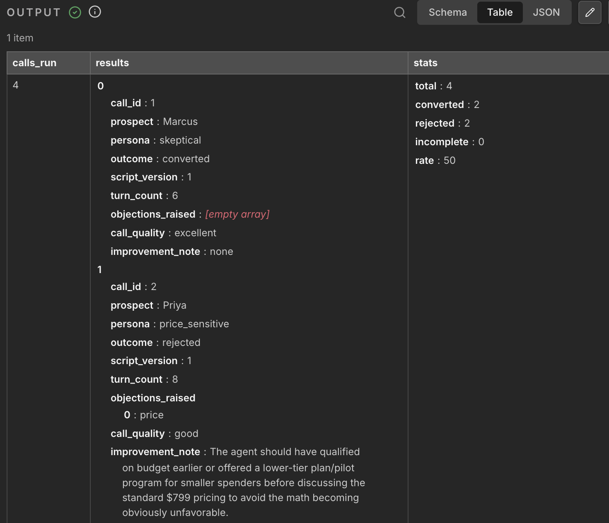
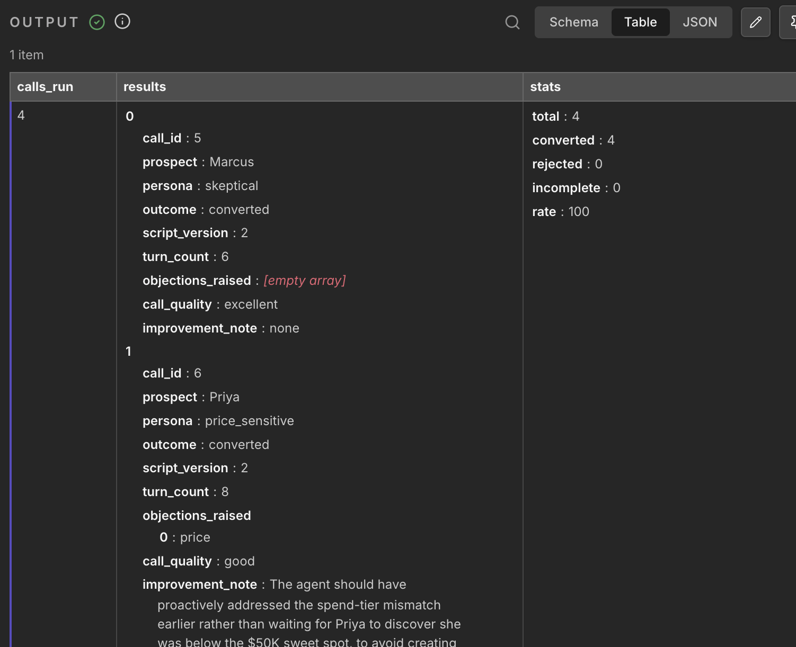

# PulseIQ Self-Improving Sales Agent

A self-improving AI sales call system. An agent named Maya conducts outbound voice calls with simulated prospects, speaks through a real text-to-speech voice, and after each call a second model analyzes the transcript. Those results feed an improvement loop that rewrites the sales script to perform better in the next round.

---

## What This System Does

Maya cold-calls four simulated prospects. Both Maya and the prospect have distinct voices generated through ElevenLabs -- the conversation happens out loud, turn by turn, while the full transcript is printed to the terminal and stored in a database.

After each call, an analyst model reads the transcript and extracts what objections came up, how the agent handled them, and what specifically could be improved. Those notes accumulate in a SQLite database.

When an improvement cycle is triggered, a third model reads all the call data for the current script version, identifies patterns in rejections and failed objection handling, and produces a revised script that addresses the observed weaknesses. The updated script is saved, the old one is archived, and the next batch of calls runs with the improved version.

The result is a feedback loop: conduct calls, learn from failures, improve the script, repeat.

---

## Architecture

```
main.py / FastAPI endpoint
        |
        v
ConversationEngine
  - loads script.json (versioned sales script)
  - builds agent system prompt from script
  - runs conversation loop (up to 8 turns)
  - each agent turn is spoken aloud via ElevenLabs (Maya's voice)
  - calls ProspectSimulator for prospect reply (spoken via prospect voice)
  - transcript is printed to terminal and stored after the call
        |
        v
CallAnalyzer
  - reads full transcript
  - extracts: objections_raised, call_quality, improvement_note
        |
        v
SQLite Database (logs/calls.db)
  - stores every call with outcome, transcript, analysis
        |
        v
ScriptImprover (triggered separately)
  - reads all calls for current script version
  - builds performance summary
  - asks LLM to produce improved script JSON
  - archives old script, saves new version
        |
        v
Next batch runs on the new script version
```

**Orchestration layer:** n8n (Docker) calls the FastAPI endpoints in sequence: run batch -> improve -> run batch -> get stats.

---

## Project Structure

```
Binox_Assessment/
  agent/
    conversation.py     # ConversationEngine: runs each call, speaks turns via TTS
    prospect.py         # ProspectSimulator: LLM-backed prospects with 4 personas
    improver.py         # ScriptImprover: reads DB data, rewrites the script
    script.json         # Active versioned sales script (currently v2)
  memory/
    analyzer.py         # CallAnalyzer: LLM-based transcript analysis
    database.py         # SQLite read/write helpers
  api/
    server.py           # FastAPI app with /run-batch, /improve, /stats endpoints
  voice/
    tts.py              # ElevenLabs TTS: speaks agent and prospect turns
  n8n/
    workflow.json       # n8n workflow (import into n8n UI)
  logs/
    calls.db            # SQLite database (auto-created on first run)
    script_history/     # Archived scripts: script_v1.json, script_v2.json ...
  docker-compose.yml    # Runs n8n locally on port 5678
  main.py               # Standalone demo: run 2 full iterations and compare
  requirements.txt
```

---

## Setup

### Prerequisites

- Python 3.12+
- Docker Desktop (for n8n orchestration)
- An Anthropic API key
- An ElevenLabs API key

### 1. Clone and install dependencies

```bash
git clone https://github.com/niharikabelavadishekar/Self-improving-sales-agent
cd Self-improving-sales-agent
python -m venv .venv
source .venv/bin/activate
pip install -r requirements.txt
```

### 2. Configure environment variables

Create a `.env` file in the project root:

```
ANTHROPIC_API_KEY=your_anthropic_key_here

ELEVENLABS_API_KEY=your_elevenlabs_key_here
ELEVENLABS_VOICE_ID=your_agent_voice_id
ELEVENLABS_PROSPECT_VOICE_ID=your_prospect_voice_id
```

For ElevenLabs voice IDs, create voices at [elevenlabs.io](https://elevenlabs.io) and copy the voice ID from the voice settings page. The prospect voice ID is optional -- if not set, the system falls back to the agent voice for both sides of the call.

---

## Running the System

### Option 1: Standalone Python demo

Runs two full iterations (v1 calls, improvement cycle, v2 calls) and prints a side-by-side comparison:

```bash
source .venv/bin/activate
python main.py
```

Each call is conducted out loud. Maya speaks her lines through ElevenLabs, and the prospect responds in a separate voice. The transcript is also printed to the terminal in real time. Sample output:

```
ITERATION 1 -- Running calls with v1 script

CALL SIMULATION
Prospect : Marcus  |  Persona : skeptical
Script   : v1  |  Product : PulseIQ

AGENT     : Hi Marcus, this is Maya calling from PulseIQ...
PROSPECT  : What makes this different from tools I already have?
...

OUTCOME : CONVERTED
TURNS   : 6

--- Analysis (call #1) ---
Objections  : already_have_solution, price
Quality     : good
Note        : Address pricing earlier to avoid prospect dropping off

...

RESULTS AFTER ITERATION 1 -- Script v1
Calls      : 4
Converted  : 2
Rejected   : 1
Incomplete : 1
Rate       : 50.0%

IMPROVEMENT CYCLE - Analyzing v1 performance
...
Script upgraded: v1 -> v2

ITERATION 2 -- Running calls with v2 script
...

IMPROVEMENT SUMMARY
v1 conversion rate : 50.0%  (2/4 calls)
v2 conversion rate : 75.0%  (3/4 calls)
Change             : +25.0%
```

### Option 2: FastAPI + n8n orchestration

**Start the API server:**

```bash
source .venv/bin/activate
uvicorn api.server:app --host 0.0.0.0 --port 8000
```

API documentation is available at `http://localhost:8000/docs`.

**Available endpoints:**

| Method | Endpoint | Description |
|--------|----------|-------------|
| GET | `/health` | Service health check |
| POST | `/run-batch` | Run 4 calls with current script |
| POST | `/improve` | Trigger improvement cycle |
| GET | `/stats?version=N` | Conversion stats for a script version |
| GET | `/calls/recent?limit=10` | Recent call records |

**Start n8n (Docker):**

```bash
docker-compose up -d
```

Open `http://localhost:5678`, create a free account, then import the workflow:

1. Go to **Workflows** in the left sidebar
2. Click **Import from file**
3. Select `n8n/workflow.json`

The workflow runs: POST `/run-batch` -> POST `/improve` -> POST `/run-batch` -> GET `/stats`. Execute it with the Run Workflow button. Node results appear in the output panel on the right side of each node.

---

## How the Self-Improvement Loop Works

### Script versioning

The sales script (`agent/script.json`) contains a `version` field. Every call records which version was used. Old versions are archived to `logs/script_history/` before being overwritten.

### What the script contains

```json
{
  "version": 2,
  "product_name": "PulseIQ",
  "opening": "...",
  "value_propositions": ["...", "..."],
  "objection_handlers": {
    "price": "...",
    "not_interested": "..."
  },
  "product_metadata": {
    "pricing": "$799/month...",
    "case_study": "..."
  },
  "closing": "..."
}
```

### What the agent can and cannot do

Maya is strictly constrained to use only the content in the script. She may not invent statistics, pricing figures, or claims not present in the script or `product_metadata`. This constraint is enforced through the system prompt and is deliberately strict: a fully unconstrained agent would be harder to evaluate and improve systematically, because the improvement loop needs a clear, stable thing to measure and rewrite.

### The improvement prompt

The improver reads all calls for the current version, builds a statistical summary (conversion rate, objection frequency, quality spread, improvement notes), and sends it to the LLM along with the full current script. The LLM returns a new script JSON with `version + 1`. The response is validated for JSON validity and required fields before the live script is touched.

### Why v1 is intentionally weak

The v1 script has generic, non-committal objection handlers. For example, the price handler says "our platform is an investment that typically pays for itself" rather than naming a specific price. The prospect personas are calibrated to reject this: the price-sensitive persona hangs up immediately if no number is given, and the hostile persona rejects generic AI buzzwords. This creates a clear failure signal for the improvement loop to act on. v2 (generated by the loop) includes specific pricing ($799/month), a concrete case study (B2B SaaS team, 28% CPL reduction), and handles objections with actual numbers rather than platitudes.

---

## Prospect Personas

Four personas are simulated, each backed by an LLM with a distinct system prompt and hard rejection conditions:

| Persona | Behavior |
|---------|----------|
| `skeptical` | Pushes for specifics; warms up after two concrete answers; hangs up after two vague ones |
| `price_sensitive` | Immediately asks for price; hangs up if given a vague ROI claim instead of a number |
| `hostile` | Rejects on AI/ROI buzzwords in the opening; needs a specific, relevant pain point to stay engaged |
| `friendly` | Open and honest; agrees to a follow-up if the agent sounds credible |

---

## Error Handling

- **LLM failures:** The agent retries once on API errors. If both attempts fail, the call is marked as an error and the batch continues.
- **TTS failures:** If ElevenLabs is unreachable mid-call, the system continues in text-only mode without crashing.
- **DB write errors:** Logged to stdout but do not interrupt call execution.
- **Improvement cycle on empty data:** Raises a clear error rather than producing a script based on nothing.
- **Invalid LLM output from improver:** Validates JSON structure and required fields before touching the live script. If the LLM returns invalid JSON or missing fields, the script is not modified.

---

## Self-Assessment

### What works well

The core loop functions as intended. v1 scripts consistently produce more rejections, the analyzer correctly identifies which objection types were raised and why the call failed, and the improvement cycle produces a v2 that handles those objections better. The architectural separation of agent, analyzer, and improver into distinct components with a shared database means each piece is independently inspectable and replaceable.

Voice is integrated directly into the conversation flow. Maya speaks each line through ElevenLabs as the call progresses, and the prospect responds in a separate voice. The transcript stored in the database is exactly the text that was spoken -- there is no divergence between what was said and what was recorded.

### Known limitations and trade-offs

**Sample size vs. signal quality.** Four calls per iteration is intentionally small for a demo. With only four data points, a single outlier call can shift the conversion rate by 25%. In a production deployment you would want 20-50 calls per version before triggering the improvement cycle. The design already supports this: the improver reads all calls for the current version from the database, so running more calls before hitting `/improve` costs nothing architecturally.

**LLM non-determinism.** Both the agent and the prospects are LLM-generated, which means two runs with identical scripts can produce different outcomes. A hostile persona that rejects on one run might stay on the line on the next, purely due to sampling variance. This makes the improvement loop directionally correct but not deterministic. A real deployment would mitigate this with larger sample sizes and human review of the generated script before promotion.

**Script constraints vs. agent flexibility.** Maya is constrained to only the content in the script. This is a deliberate trade-off: an unconstrained agent would be harder to evaluate and improve systematically, because you cannot attribute a better outcome to a specific script change if the agent is also improvising. The constraint makes the feedback loop meaningful at the cost of the agent sometimes redirecting instead of answering a question the script does not cover.

**API cost vs. human SDR cost.** Each simulated call makes approximately 10-15 LLM requests (agent turns, prospect turns, analysis). At Claude Haiku pricing this costs well under $0.01 per call. ElevenLabs TTS at standard rates adds roughly $0.05-0.10 per call depending on turn length. A real outbound call from a human SDR costs $2-5 in direct salary alone, before accounting for training, management, and turnover. At scale, an AI-assisted call system running this pattern significantly reduces cost per qualified lead, while the improvement loop compounds that advantage by raising conversion rates over time without additional headcount.

**Voice latency.** ElevenLabs audio generation adds 2-3 seconds per turn. For demonstration this is acceptable. A production system would use streaming TTS (which ElevenLabs supports) to eliminate the pause between turns.

### Business impact reasoning

The real-world problem this system addresses is that sales scripts are static. A human SDR team might iterate on their pitch once a quarter after a manager reviews call recordings. This system closes that loop automatically after every batch: calls happen, outcomes are recorded, objection patterns surface, and the script is rewritten the same day.

For a B2B SaaS company running outbound at scale, a 25% improvement in conversion rate (as demonstrated from v1 to v2) directly reduces customer acquisition cost. If a team books 100 discovery calls per month at a 10% conversion rate, raising that to 12.5% means 25 extra meetings from the same call volume -- with no change in headcount or ad spend.

The improvement notes generated per call also serve a second purpose: they give sales managers specific, actionable coaching points ("agent should have surfaced the pricing tier mismatch earlier") without requiring them to listen to recordings. At 50+ calls per day this kind of automated summarization saves several hours of review time per week.

The `/improve` endpoint and n8n workflow are already structured to support scheduled execution. A cron-triggered n8n workflow could run the full improvement cycle every Monday morning automatically, so the script that goes into production each week is always informed by the previous week's call data.

---

## Demo

### n8n Workflow Execution

The n8n workflow automates the full self-improvement pipeline: Run Batch (v1 Script) -> Improve Script -> Run Batch (v2 Script) -> Get Final Stats.

**Before running** -- all nodes idle:



**After first batch completes** -- first node green, improvement cycle running:



**Fully complete** -- all four nodes green, final stats returned:



### Call Outcome Data

**v1 Script output** (50% conversion rate -- 2 converted, 2 rejected):



Marcus (skeptical) converted in 6 turns with no objections logged. Priya (price_sensitive) rejected immediately -- the v1 price handler said "it pays for itself" without a number, which triggered her hang-up condition.

**v2 Script output** (100% conversion rate -- all 4 converted):



The improvement cycle added specific pricing ($799/month) and the B2B case study to the price objection handler. Priya converted in 8 turns on v2. Marcus converted in 6 turns with call quality rated "excellent."

### Voice Call Recordings

The following recordings capture Maya and the prospect speaking through their respective ElevenLabs voices. The conversation is entirely LLM-driven -- Maya follows the script, the prospect responds according to their persona, and both sides speak aloud in real time.

**Conversion call** (Marcus, friendly persona): [docs/demo_converted.m4a](docs/demo_converted.m4a)

**Rejection call** (Priya, price_sensitive persona on v1 script): [docs/demo_rejected.m4a](docs/demo_rejected.m4a)

---

## Tech Stack

| Component | Technology |
|-----------|------------|
| LLM (agent, prospect, analyzer, improver) | Claude claude-haiku-4-5-20251001 (Anthropic) |
| Text-to-speech | ElevenLabs (eleven_turbo_v2_5) |
| Database | SQLite |
| API layer | FastAPI + Uvicorn |
| Orchestration | n8n (Docker) |
| Audio playback | macOS `afplay` |
